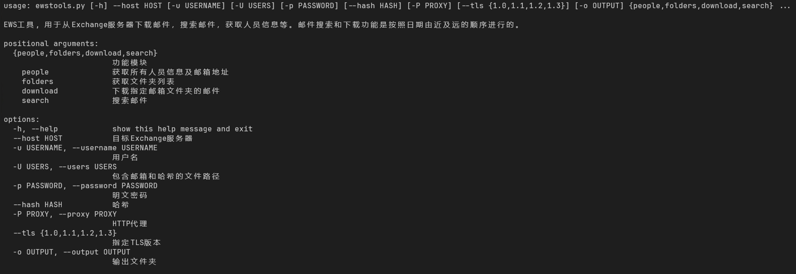
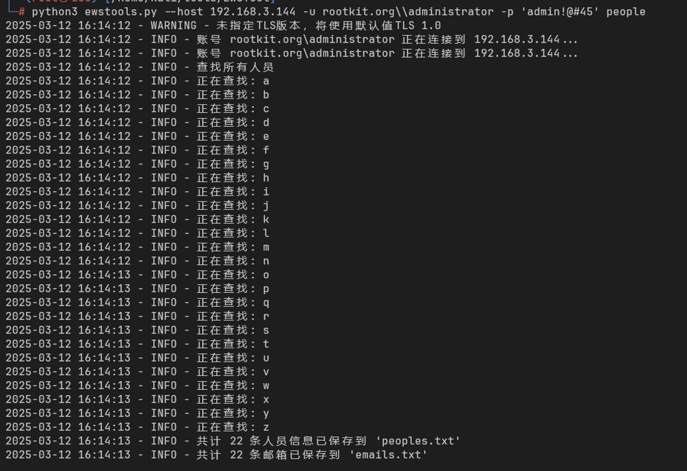
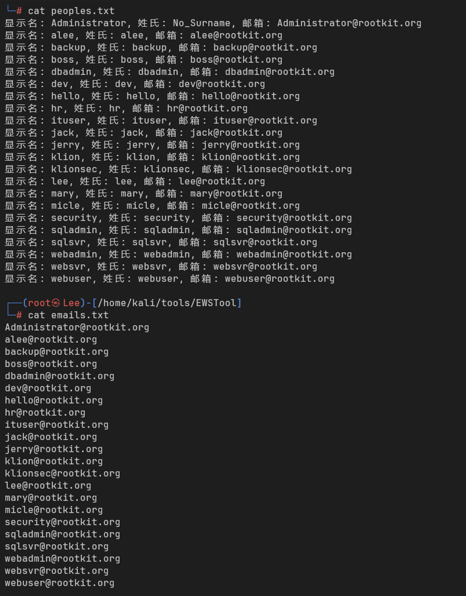
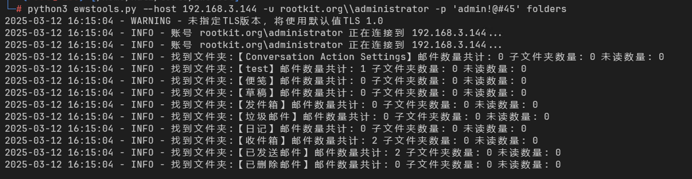
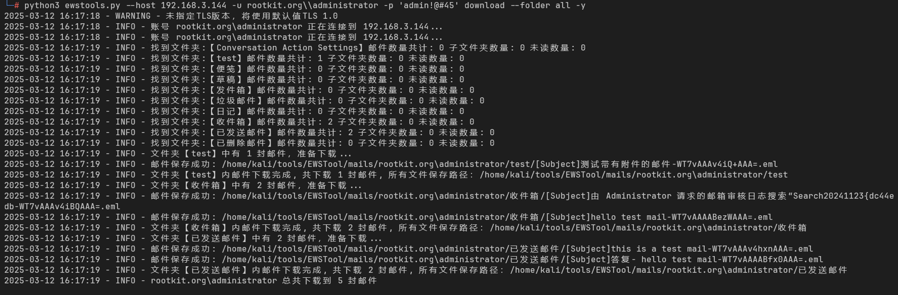
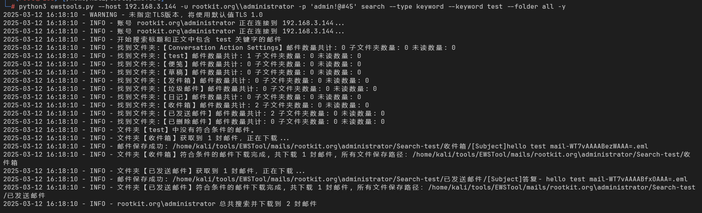
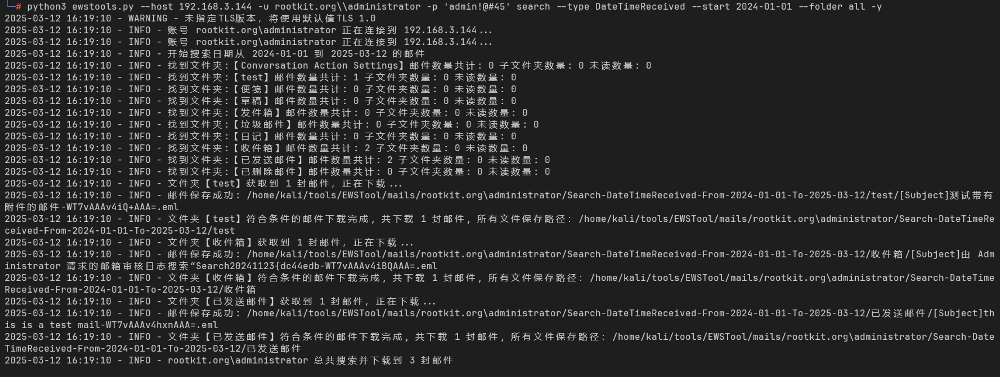
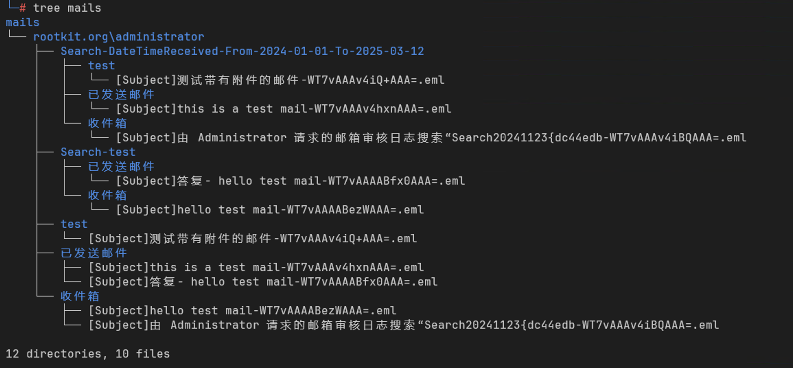
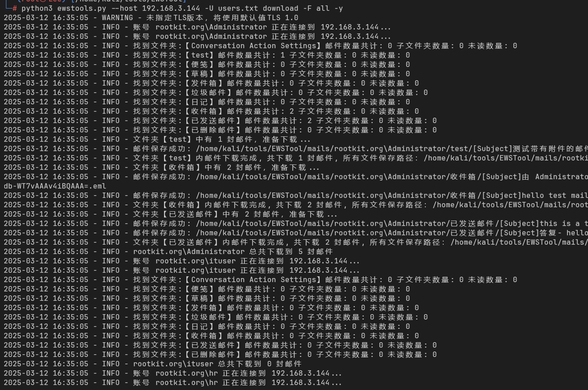
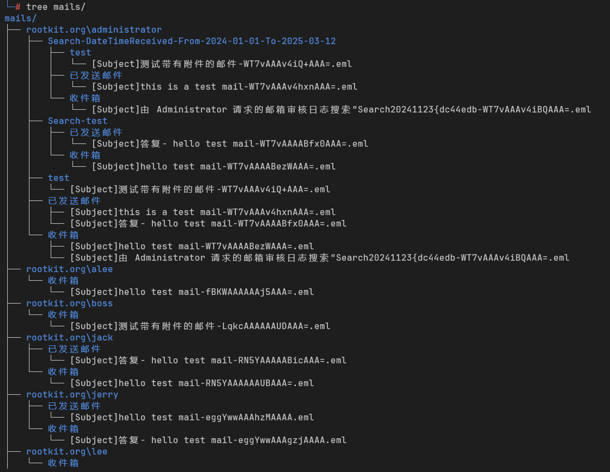

# EWSTool - Exchange工具集

EWSTool 用于从 Exchange 服务器下载邮件，搜索邮件，获取人员信息等。

[](LICENSE)
[](https://www.python.org/)

## ⚠️ 法律声明

1. 本工具仅限授权测试使用，禁止用于非法用途
2. 使用前需获得目标系统的书面渗透测试授权
3. 操作敏感数据时请遵守当地数据隐私法规

## 核心功能

- **获取人员信息**：获取所有人员信息及邮箱地址。
- **获取文件夹列表**：获取邮箱中的所有文件夹列表。
- **下载邮件**：下载指定邮箱文件夹的邮件。
- **搜索邮件**：按关键字或日期范围搜索邮件。
- **批量下载邮件**：下载指定一批邮箱的邮件。
- **批量搜索邮件**：按关键字或日期范围搜索指定一批邮箱的邮件。
- **代理支持**：支持HTTP代理。

## 安装

1. 克隆项目到本地：
    ```bash
    git clone https://github.com/simonlee-hello/EWSTool
    ```
2. 进入项目目录：
    ```bash
    cd EWSTool
    ```
3. 安装依赖：
    ```bash
    pip install -r requirements.txt
    ```

## 使用方法



### 获取人员信息


### 获取文件夹列表

### 下载邮件

### 搜索邮件



### 批量下载邮件



### 命令行参数

- `--host`：目标Exchange服务器地址（必填）。
- `-u`, `--username`：用户名（可选）。
- `-U`, `--users`：用户邮箱及哈希列表文件（可选）。
- `-p`, `--password`：明文密码（可选）。
- `--hash`：NTLM 哈希密码（可选）。
- `-P`, `--proxy`：HTTP代理（可选）。格式：`http://127.0.0.1:8080`。
- `--tls`：是否使用TLS（可选）。可选值:1.0, 1.1, 1.2, 1.3。
- `-o`,`--output`：输出目录（可选）。默认为mails。
- `people`：获取所有人员信息及邮箱地址。
- `folders`：获取文件夹列表。
- `download`：下载指定邮箱文件夹的邮件。（按照日期由近及远的顺序进行）
    - `-F`, `--folder`：文件夹名称。(默认所有文件夹)
    - `--id`：邮件ID。(指定某个邮件下载，在批量下载失败后使用)
    - `--key`：邮件ChangeKey。(指定某个邮件下载，在批量下载失败后使用)
    - `-y`：跳过确认。
- `search`：搜索邮件。（按照日期由近及远的顺序进行）
    - `-t`, `--type`：搜索类型（`keyword`或`DateTimeReceived`或`DateTimeSent`）。
    - `-k`, `--keyword`：关键字。
    - `--start`：开始日期（`YYYY-MM-DD`）。
    - `--end`：结束日期（`YYYY-MM-DD`）。(为空时默认为当前日期)
    - `-F`, `--folder`：文件夹名称。(默认所有文件夹)

**注意**：

1. 指定邮箱操作时`--password`或`--hash`必须提供其中之一。
2. 指定批量操作时`--users`必须提供。

users.txt文件格式，目前只支持NTLM Hash：
```txt
username1:hash1
username2:hash2
...
```

### 示例

1. 获取所有人员信息：
    ```bash
    python ewstools.py --host <host> --username <username> --password <password> people
    python ewstools.py --host <host> --username <username> --hash <hash> people
    ```

2. 获取文件夹列表：
    ```bash
    # 指定用户名和密码
    python ewstools.py --host <host> --username <username> --password <password> folders
    # 指定用户名和哈希
    python ewstools.py --host <host> --username <username> --hash <hash> folders
    # 批量获取文件夹列表
    python ewstools.py --host <host> --users <users_file> folders
    ```

3. 下载邮件（按照日期从近到远进行下载）：
    ```bash
    # 下载所有文件夹中的邮件
    python ewstools.py --host <host> --username <username> --password <password> download --folder all
    # 下载指定文件夹中的邮件
    python ewstools.py --host <host> --username <username> --password <password> folders
    python ewstools.py --host <host> --username <username> --password <password> download --folder <folder_name>
    # 跳过确认
    python ewstools.py --host <host> --username <username> --password <password> download --folder all -y
    # 批量下载邮件
    python ewstools.py --host <host> --users <users_file> download --folder all
    # 跳过确认
    python ewstools.py --host <host> --users <users_file> download --folder all -y
    ```

4. 下载指定邮件：
    ```bash
    python ewstools.py --host <host> --username <username> --password <password> download --id <id> --key <key>
    ```

5. 按关键字搜索邮件（按照日期从近到远进行下载）：
    ```bash
    # 在所有文件夹中搜索关键字
    python ewstools.py --host <host> --username <username> --password <password> search --type keyword --keyword <keyword> --folder all
    # 在指定文件夹中搜索关键字
    python ewstools.py --host <host> --username <username> --password <password> folders
    python ewstools.py --host <host> --username <username> --password <password> search --type keyword --keyword <keyword> --folder <folder_name>
    # 跳过确认
    python ewstools.py --host <host> --username <username> --password <password> search --type keyword --keyword <keyword> --folder all -y
    # 批量搜索邮件
    python ewstools.py --host <host> --users <users_file> search --type keyword --keyword <keyword> --folder all -y
    ```

6. 按日期范围搜索邮件并下载（按照日期从近到远进行下载）：
    ```bash
    # 在所有文件夹中搜索日期范围
    python ewstools.py --host <host> --username <username> --password <password> search --type DateTimeReceived --start <start_date> --end <end_date> --folder all
    # 在指定文件夹中搜索日期范围
    python ewstools.py --host <host> --username <username> --password <password> folders
    python ewstools.py --host <host> --username <username> --password <password> search --type DateTimeReceived --start <start_date> --end <end_date> --folder <folder_name>
    # 跳过确认
    python ewstools.py --host <host> --username <username> --password <password> search --type DateTimeReceived --start <start_date> --end <end_date> --folder all -y
    # 批量搜索邮件
    python ewstools.py --host <host> --users <users_file> search --type DateTimeReceived --start <start_date> --end <end_date> --folder all -y
    ```

## 配置

在`ewstools.py`文件中，可以配置以下参数：

- `TEMPLATES_FOLDER`：模板文件夹路径。
- `HTTP_PROTO`：HTTP协议（默认`https`）。
- `EXCHANGE_NAMESPACE`：Exchange命名空间。
- `HEADERS`：HTTP请求头。

## 日志

日志默认输出到控制台，可以在`logging.basicConfig`中配置日志级别和格式。

## 注意事项

- 确保提供的用户名和密码（或哈希）具有访问Exchange服务器的权限。
- 使用代理时，请确保代理服务器配置正确。

## 贡献指南

欢迎提交Issue或PR